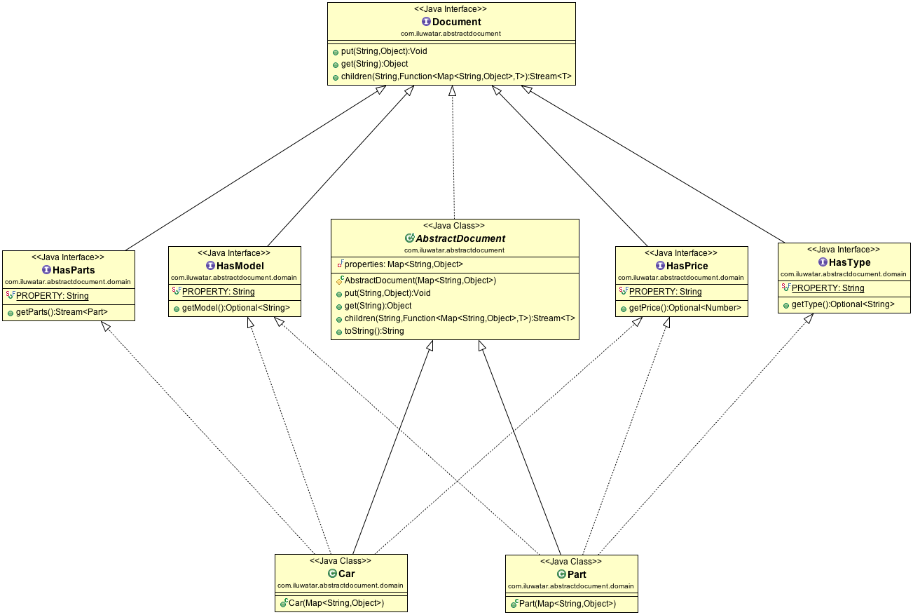

解释：
允许在对象不感知的情况下将属性附加到对象上。
利用特征类将不同的属性分成不同的接口。

举例说明：
car有很多的部件，每个部件都有model,type,price属性，通过carProperties存放汽车的model,type,parts

适用：
1. 需要动态的添加新的属性，并保证类的安全性
2. 想要以一种灵活的方式来以树状结构组织域
3. 想要更宽松的耦合系统

小注意点：
Document 接口children方法使用Function 将构造部件的方法暴露出去

