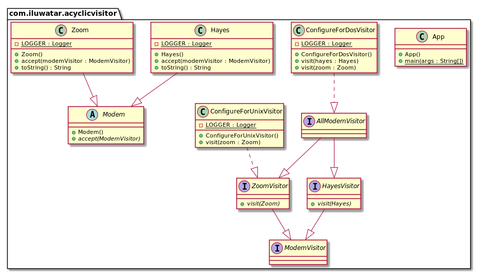

目的：
解决Visitor循环依赖问题，Visitor中访问者基类和被访问者强依赖，被访问者结构发生改变，访问者也要从基类开始一起改变。
访问者基类为空，通过组合访问者的形式提供操作

适用：
1. Visitor适用场景
2. 类层次结构之间没有依赖关系
3. 如果类层次结构具有新成员，则不会导致现有访问者中的编译失败

坏处：
1. 通过证明它可以接受所有访客，但实际上仅对特定访客感兴趣
2. 必须为可访问的类层次结构中的所有成员创建访问者，通过组合这些访问者提供操作