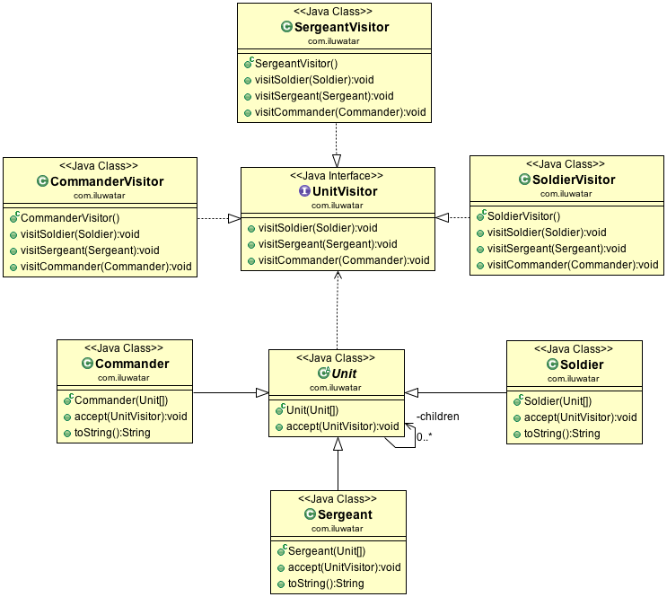

目的：
定义新的操作，无需更改所操作元素的类

适用：
1. 对象结构是包含许多具有不同接口的元素类，并且希望根据这些接口具体实现类对元素类执行操作
2. 需要对象结构中的元素对象执行许多不同且不相关的操作，并且想避免这些操作污染元素类，访问者可以通过在一个类中定义相关的操作将它们保持在一起。当许多结构共享对象结构时，使用访问者模式将操作仅放在需要它们的那些应用程序中。
3. 结构对象的类很少变化，但是经常想在结构上定义新的操作。

不适用：
1. 更改对象结构中的元素类，需要重新定义所有访问者的接口，这可能会导致成本太大。如果对象结构类经常更改，最好在这些类中定义操作。